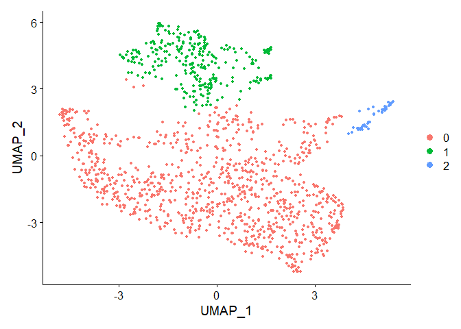

Integrating Data
================
Alina Kline-Schoder
Started on 04/19/2021  
Compiled: January 14, 2022

-   [Microglia Data analysis](#microglia-data-analysis)
-   [Clustering](#clustering)
-   [Phase scoring](#phase-scoring)
-   [DEG between all treatment
    groups](#deg-between-all-treatment-groups)
    -   [Ontology search for 1d v sham and 3d v
        Sham](#ontology-search-for-1d-v-sham-and-3d-v-sham)
-   [Saving for figures - Microglia
    DEG](#saving-for-figures---microglia-deg)

# Microglia Data analysis

    ## Warning: package 'Seurat' was built under R version 4.1.2

    ## Warning: package 'BiocManager' was built under R version 4.1.2

    ## Warning: package 'ggplot2' was built under R version 4.1.2

    ## Warning: package 'readr' was built under R version 4.1.2

    ## Warning: package 'ggsignif' was built under R version 4.1.2

    ## Warning: package 'broom' was built under R version 4.1.2

    ## Warning: package 'ggpmisc' was built under R version 4.1.2

    ## Warning: package 'ggpp' was built under R version 4.1.2

# Clustering

``` r
DefaultAssay(CAM)<-"integrated"
CAM <- ScaleData(CAM)
```

    ## Centering and scaling data matrix

``` r
CAM <- RunPCA(CAM)
```

    ## PC_ 1 
    ## Positive:  Rps11, Rpsa, Rpl39, Rpl13, Rpl32, Rpl18a, Rps5, Rps4x, Rps7, Rps24 
    ##     Rps15a, Rpl23, Rps3a1, Rpl6, Rps8, Rpl19, Rps19, Rps16, Rpl27a, Eef1b2 
    ##     Rps13, Rps20, Rpl9, Rps27a, Rps9, Rps28, Rps26, Rack1, Eef1a1, Rpl17 
    ## Negative:  Ctsb, Ftl1, Ctsd, Cstb, Lgmn, Cd68, Apoe, Plin2, Ctsz, Sdcbp 
    ##     C3ar1, Grn, Lamp1, Hmox1, Bri3, Psap, Fcgr1, Fth1, Ms4a6d, Capg 
    ##     Tmem86a, Lgals3, Akr1a1, Ctss, Txn1, Tgfbi, Ms4a7, Msrb1, C5ar1, Adssl1 
    ## PC_ 2 
    ## Positive:  Ifitm3, Srgn, Vim, Slfn2, Slfn5, S100a6, Ifi209, Actg1, S100a10, S100a4 
    ##     Tpt1, Ifi204, Smox, Mcl1, Cebpb, Fxyd5, Ifi211, Tspo, Tmsb10, Ifi207 
    ##     Cd44, Trim30a, S100a11, H3f3a, Lilrb4a, Slfn8, Emilin2, Anxa2, Gch1, Ifitm2 
    ## Negative:  Pf4, Gas6, Fcrls, Lyve1, Ltc4s, Selenop, Cd163, Mrc1, Igfbp4, Cst3 
    ##     Cp, Cbr2, Serinc3, Csf1r, Pmp22, Ccl24, Smagp, Malat1, C1qa, C1qc 
    ##     Igf1, Cd81, Hpgds, Cd209f, Gpr34, Mgl2, Ang, Hexa, Rgs10, Rnase4 
    ## PC_ 3 
    ## Positive:  Lyz2, F13a1, Gda, Cebpb, Cd14, Tpd52, Gsr, Cd44, Mgst1, Ccl6 
    ##     Emb, Fcgr3, Gm9733, Tyrobp, Ptpn1, Mrpl33, Aldh2, Cd302, Klf13, AI839979 
    ##     Kdm6b, Fosl2, Svil, Ier3, Adgre5, H3f3a, Plec, Ndel1, Emilin2, Btg1 
    ## Negative:  Phf11b, Psmb8, Bst2, Psmb9, Tspo, H2-Ab1, Ifit3, H2-Aa, Epsti1, Ms4a4c 
    ##     Cd74, H2-Eb1, H2-T23, Isg15, Psme1, Ccnd2, Pkib, Klrk1, Cnp, H2-T22 
    ##     Ube2l6, H2-DMb1, Ywhah, Ccnd1, Mndal, Apobec3, Cxcl16, Selplg, Fgl2, Ptms 
    ## PC_ 4 
    ## Positive:  Aldoa, Eif4a1, Lgals3, Pfn1, Gapdh, Uap1l1, Ppp1r14b, Pdia6, Hsp90ab1, Ftl1 
    ##     Tpi1, Psap, Mif, Dynll1, Prdx1, Calr, Fth1, Cd9, Tubb5, C1qbp 
    ##     Ckap4, Lgals1, Anxa5, Tnfsf12, Ptma, Sdf2l1, Gsn, Tubb4b, Rps27l, Pgam1 
    ## Negative:  Ifi203, Ifi209, Slfn5, Mndal, Gbp7, Ifi47, Ms4a6b, Herc6, Trim30a, Ifi211 
    ##     Samhd1, Gbp5, Ifit3, Stat1, Parp14, March5, Ddx58, Fgl2, Ifih1, Sp140 
    ##     Ifi204, Ogfrl1, Lyn, Ms4a6c, Ifi207, Nsd3, Stat2, 9930111J21Rik2, Clec2d, Slfn8 
    ## PC_ 5 
    ## Positive:  Gpx1, Plac8, Ccr2, Clec4a3, Lst1, Alox5ap, Coro1a, Hmgb2, Ethe1, Ypel3 
    ##     Hacd4, Dbi, Dok3, Rassf4, Smpdl3a, Ms4a6c, Rgs2, Mgst1, Add3, Klf2 
    ##     Prdx5, Idh1, Tifab, S100a6, Ly6e, C1galt1c1, Epsti1, Cyp4f18, Aif1, Sirpb1c 
    ## Negative:  Basp1, Spag9, Cd86, Sqstm1, Ninj1, Cd83, Jdp2, Ifrd1, Lmnb1, Ptafr 
    ##     Bcl2a1d, Lilrb4a, Gpr137b, Txnrd1, Lilr4b, Por, Card19, Ehd1, Plek, Smox 
    ##     Rilpl2, Tpm4, Rbpj, Slamf7, Eif4a1, Esd, Mdfic, Bcl2a1b, Rel, Mdm2

``` r
CAM <- FindNeighbors(CAM, dims = 1:10)
```

    ## Computing nearest neighbor graph

    ## Computing SNN

``` r
CAM <- FindClusters(CAM, resolution = 0.1)
```

    ## Modularity Optimizer version 1.3.0 by Ludo Waltman and Nees Jan van Eck
    ## 
    ## Number of nodes: 1287
    ## Number of edges: 43784
    ## 
    ## Running Louvain algorithm...
    ## Maximum modularity in 10 random starts: 0.9224
    ## Number of communities: 3
    ## Elapsed time: 0 seconds

``` r
CAM <- RunUMAP(CAM, dims = 1:10,metric = "euclidean")
```

    ## Warning: The default method for RunUMAP has changed from calling Python UMAP via reticulate to the R-native UWOT using the cosine metric
    ## To use Python UMAP via reticulate, set umap.method to 'umap-learn' and metric to 'correlation'
    ## This message will be shown once per session

    ## 21:06:18 UMAP embedding parameters a = 0.9922 b = 1.112

    ## 21:06:18 Read 1287 rows and found 10 numeric columns

    ## 21:06:18 Using FNN for neighbor search, n_neighbors = 30

    ## 21:06:18 Commencing smooth kNN distance calibration using 1 thread

    ## 21:06:19 Initializing from normalized Laplacian + noise

    ## 21:06:19 Commencing optimization for 500 epochs, with 52490 positive edges

    ## 21:06:23 Optimization finished

``` r
DimPlot(CAM)
```

<!-- -->

# Phase scoring

``` r
setwd("F:/Data/Sequencing/Files")
Barres<-read.csv(file = 'BarresCellStateGenes.csv')
source('AKS_CellCycleScoring.R')
AllGenes<-rownames(CAM@assays$RNA)
G2M<-as.character(Barres[Barres$G2.M %in% AllGenes,]$G2.M)
MG1<-as.character(Barres[Barres$M.G1 %in% AllGenes,]$M.G1)
G1S<-as.character(Barres[Barres$G1.S %in% AllGenes,]$G1.S)
S<-as.character(Barres[Barres$S %in% AllGenes,]$S)
M<-as.character(Barres[Barres$M %in% AllGenes,]$M)
Matrix<-CAM@assays$RNA@counts
Matrix_Sub<-as.data.frame(t(Matrix[S,]))
Matrix_Sub$Cell_Sum<-rowSums(Matrix_Sub)
Cor<-cor(as.matrix(Matrix_Sub))
```

    ## Warning in cor(as.matrix(Matrix_Sub)): the standard deviation is zero

``` r
Cor<-Cor[dim(Cor)[2],]
Cor<-Cor[names(Cor)!="Cell_Sum"]
Cor[is.na(Cor)]<-0
S.Genes <- names(Cor[Cor>0.3])
Matrix_Sub<-as.data.frame(t(Matrix[G2M,]))
Matrix_Sub$Cell_Sum<-rowSums(Matrix_Sub)
Cor<-cor(as.matrix(Matrix_Sub))
```

    ## Warning in cor(as.matrix(Matrix_Sub)): the standard deviation is zero

``` r
Cor<-Cor[dim(Cor)[2],]
Cor<-Cor[names(Cor)!="Cell_Sum"]
Cor[is.na(Cor)]<-0
G2M.Genes <- names(Cor[Cor>0.3])
Matrix_Sub<-as.data.frame(t(Matrix[MG1,]))
Matrix_Sub$Cell_Sum<-rowSums(Matrix_Sub)
Cor<-cor(as.matrix(Matrix_Sub))
Cor<-Cor[dim(Cor)[2],]
Cor<-Cor[names(Cor)!="Cell_Sum"]
Cor[is.na(Cor)]<-0
MG1.Genes <- names(Cor[Cor>0.3])
Matrix_Sub<-as.data.frame(t(Matrix[G1S,]))
Matrix_Sub$Cell_Sum<-rowSums(Matrix_Sub)
Cor<-cor(as.matrix(Matrix_Sub))
Cor<-Cor[dim(Cor)[2],]
Cor<-Cor[names(Cor)!="Cell_Sum"]
Cor[is.na(Cor)]<-0
G1S.Genes <- names(Cor[Cor>0.3])
Matrix_Sub<-as.data.frame(t(Matrix[M,]))
Matrix_Sub$Cell_Sum<-rowSums(Matrix_Sub)
Cor<-cor(as.matrix(Matrix_Sub))
```

    ## Warning in cor(as.matrix(Matrix_Sub)): the standard deviation is zero

``` r
Cor<-Cor[dim(Cor)[2],]
Cor<-Cor[names(Cor)!="Cell_Sum"]
Cor[is.na(Cor)]<-0
M.Genes <- names(Cor[Cor>0.3])

DefaultAssay(CAM)<-"RNA"
CAM<-AKS_CellCycle(CAM,s.features = S.Genes,g1s.features=G1S.Genes,g2m.features = G2M.Genes,m.features = M.Genes,mg1.features = MG1.Genes)
Data_New<-as.data.frame(cbind(CAM$G1S.Score,CAM$S.Score,CAM$G2M.Score,CAM$M.Score,CAM$MG1.Score))
Data_New<-as.data.frame(as.matrix(scale(Data_New,scale = TRUE,center=TRUE)))
colnames(Data_New)<-c("G1S","S","G2M","M","MG1")
CAM$G1S.Score<-Data_New$G1S
CAM$S.Score<-Data_New$S
CAM$G2M.Score<-Data_New$G2M
CAM$M.Score<-Data_New$M
CAM$MG1.Score<-Data_New$MG1
Scores<-Data_New
Scores$MaxScore<-apply(Scores,1,max)
Scores$Assignment1<-colnames(Scores)[apply(Scores,1,which.max)]
Scores[Scores$MaxScore<1,]$Assignment1<-"G0"
CAM$Phase<-factor(Scores$Assignment1,levels = c("G0","G1S","S","G2M","M","MG1"))
#Plotting
Scores$Assignment2<-Scores$Assignment1
Scores$Assignment3<-Scores$Assignment1
Scores[Scores$Assignment1=="G1S",]$Assignment2<-"G1S.S"
Scores[Scores$Assignment1=="G1S",]$Assignment3<-"MG1.G1S"
Scores[Scores$Assignment1=="S",]$Assignment2<-"G1S.S"
Scores[Scores$Assignment1=="S",]$Assignment3<-"S.G2M"
Scores[Scores$Assignment1=="G2M",]$Assignment2<-"G2M.M"
Scores[Scores$Assignment1=="G2M",]$Assignment3<-"S.G2M"
Scores[Scores$Assignment1=="M",]$Assignment2<-"G2M.M"
Scores[Scores$Assignment1=="M",]$Assignment3<-"M.MG1"
Scores[Scores$Assignment1=="MG1",]$Assignment2<-"MG1.G1S"
Scores[Scores$Assignment1=="MG1",]$Assignment3<-"M.MG1"
G1S<-cor(t(Data_New),     c( 2,-2,-2,-2,-2))
G1S.S<-cor(t(Data_New),   c( 2, 2,-2,-2,-2))
S<-cor(t(Data_New),       c(-2, 2,-2,-2,-2))
S.G2M<-cor(t(Data_New),   c(-2, 2,2,-2,-2))
G2M<-cor(t(Data_New),     c(-2,-2,2,-2,-2))
G2M.M<-cor(t(Data_New),   c(-2,-2,2,2,-2))
M<-cor(t(Data_New),       c(-2,-2,-2,2,-2))
M.MG1<-cor(t(Data_New),   c(-2,-2,-2,2,2))
MG1<-cor(t(Data_New),     c(-2,-2,-2,-2,2))
MG1.G1S<-cor(t(Data_New), c( 2,-2,-2,-2,2))
G0<-cor(t(Data_New),      c(-2,-2,-2,-2,-1.999999))
  
Correlations<-cbind(G1S,G1S.S,S,S.G2M,G2M,G2M.M,M,M.MG1,MG1,MG1.G1S,G0)
colnames(Correlations)<-c("G1S","G1S.S","S","S.G2M","G2M","G2M.M","M","M.MG1","MG1","MG1.G1S","G0")
FindingMax<-data.frame(Correlation1=Correlations[cbind(1:dim(Scores)[1],match(Scores$Assignment1,colnames(Correlations)))])
FindingMax$Correlation2<-as.numeric(Correlations[cbind(1:dim(Scores)[1],match(Scores$Assignment2,colnames(Correlations)))])
FindingMax$Correlation3<-Correlations[cbind(1:dim(Scores)[1],match(Scores$Assignment3,colnames(Correlations)))]
FindingMax$Correlation_G0<-Correlations[cbind(1:dim(Scores)[1],dim(Correlations)[2])]
Which<-apply(FindingMax,1,which.max)
Max<-apply(FindingMax,1,max)
Which[Max<0.75]<-"4"
Options<-cbind(Scores$Assignment1,Scores$Assignment2,Scores$Assignment3,"G0")
Assignnment<-data.frame(ChosenSpecific=Options[cbind(1:dim(Scores)[1],as.numeric(Which))],Max=Max,ChosenBroad=Options[,1])
Assignnment$ChosenSpecific<-as.character(Assignnment$ChosenSpecific)
Assignnment$ChosenBroad<-as.character(Assignnment$ChosenBroad)
Assignnment$Max<-as.numeric(as.character(Assignnment$Max))
#Ordering data for heatmap
  
Assignnment$ChosenSpecific<-factor(Assignnment$ChosenSpecific,levels=c("MG1.G1S","G1S","G1S.S","S","S.G2M","G2M","G2M.M","M","M.MG1","MG1","G0"))
Assignnment$ChosenBroad<-factor(Assignnment$ChosenBroad,levels=c("G1S","S","G2M","M","MG1","G0"))
Data_New<-Data_New[order(Assignnment$ChosenSpecific,-Assignnment$Max),]
AssignnmentNew<-Assignnment[order(Assignnment$ChosenSpecific,-Assignnment$Max),]
AssignnmentNew_Sub<-AssignnmentNew[AssignnmentNew$ChosenSpecific!="G0",]
Data_New_Sub<-Data_New[AssignnmentNew$ChosenSpecific!="G0",]
```

# DEG between all treatment groups

``` r
Idents(CAM)<-"Treatment"
CAM_Treatment_Markers<-FindAllMarkers(CAM,only.pos = T)
```

    ## Calculating cluster Naive

    ## Calculating cluster Sham

    ## Calculating cluster 1d BBBO

    ## Calculating cluster 3d BBBO

``` r
Markers_1d <- FindMarkers(CAM,ident.1 = "1d BBBO", ident.2 = "Sham")
Markers_3d <- FindMarkers(CAM,ident.1 = "3d BBBO", ident.2 = "Sham")
```

## Ontology search for 1d v sham and 3d v Sham

``` r
library(org.Mm.eg.db)
```

    ## Loading required package: AnnotationDbi

    ## Loading required package: stats4

    ## Loading required package: BiocGenerics

    ## Loading required package: parallel

    ## 
    ## Attaching package: 'BiocGenerics'

    ## The following objects are masked from 'package:parallel':
    ## 
    ##     clusterApply, clusterApplyLB, clusterCall, clusterEvalQ,
    ##     clusterExport, clusterMap, parApply, parCapply, parLapply,
    ##     parLapplyLB, parRapply, parSapply, parSapplyLB

    ## The following object is masked from 'package:gridExtra':
    ## 
    ##     combine

    ## The following objects are masked from 'package:dplyr':
    ## 
    ##     combine, intersect, setdiff, union

    ## The following objects are masked from 'package:stats':
    ## 
    ##     IQR, mad, sd, var, xtabs

    ## The following objects are masked from 'package:base':
    ## 
    ##     anyDuplicated, append, as.data.frame, basename, cbind, colnames,
    ##     dirname, do.call, duplicated, eval, evalq, Filter, Find, get, grep,
    ##     grepl, intersect, is.unsorted, lapply, Map, mapply, match, mget,
    ##     order, paste, pmax, pmax.int, pmin, pmin.int, Position, rank,
    ##     rbind, Reduce, rownames, sapply, setdiff, sort, table, tapply,
    ##     union, unique, unsplit, which.max, which.min

    ## Loading required package: Biobase

    ## Welcome to Bioconductor
    ## 
    ##     Vignettes contain introductory material; view with
    ##     'browseVignettes()'. To cite Bioconductor, see
    ##     'citation("Biobase")', and for packages 'citation("pkgname")'.

    ## Loading required package: IRanges

    ## Loading required package: S4Vectors

    ## Warning: package 'S4Vectors' was built under R version 4.1.1

    ## 
    ## Attaching package: 'S4Vectors'

    ## The following object is masked from 'package:tidyr':
    ## 
    ##     expand

    ## The following objects are masked from 'package:dplyr':
    ## 
    ##     first, rename

    ## The following objects are masked from 'package:Matrix':
    ## 
    ##     expand, unname

    ## The following object is masked from 'package:plyr':
    ## 
    ##     rename

    ## The following objects are masked from 'package:base':
    ## 
    ##     expand.grid, I, unname

    ## 
    ## Attaching package: 'IRanges'

    ## The following object is masked from 'package:rstatix':
    ## 
    ##     desc

    ## The following object is masked from 'package:purrr':
    ## 
    ##     reduce

    ## The following objects are masked from 'package:dplyr':
    ## 
    ##     collapse, desc, slice

    ## The following object is masked from 'package:plyr':
    ## 
    ##     desc

    ## The following object is masked from 'package:grDevices':
    ## 
    ##     windows

    ## 
    ## Attaching package: 'AnnotationDbi'

    ## The following object is masked from 'package:rstatix':
    ## 
    ##     select

    ## The following object is masked from 'package:dplyr':
    ## 
    ##     select

    ## The following object is masked from 'package:MASS':
    ## 
    ##     select

    ## 

``` r
library(topGO)
```

    ## Loading required package: graph

    ## Warning: package 'graph' was built under R version 4.1.1

    ## 
    ## Attaching package: 'graph'

    ## The following object is masked from 'package:stringr':
    ## 
    ##     boundary

    ## The following object is masked from 'package:plyr':
    ## 
    ##     join

    ## Loading required package: GO.db

    ## 

    ## Loading required package: SparseM

    ## 
    ## Attaching package: 'SparseM'

    ## The following object is masked from 'package:base':
    ## 
    ##     backsolve

    ## 
    ## groupGOTerms:    GOBPTerm, GOMFTerm, GOCCTerm environments built.

    ## 
    ## Attaching package: 'topGO'

    ## The following object is masked from 'package:IRanges':
    ## 
    ##     members

``` r
clustermarkers_1d_filt<-Markers_1d[Markers_1d$p_val_adj<0.05,]
Onto_1d<-GO_Search(CAM,clustermarkers_1d_filt)
```

    ## 
    ## Building most specific GOs .....

    ##  ( 6873 GO terms found. )

    ## 
    ## Build GO DAG topology ..........

    ##  ( 10823 GO terms and 24668 relations. )

    ## 
    ## Annotating nodes ...............

    ##  ( 2843 genes annotated to the GO terms. )

    ## 
    ##           -- Classic Algorithm -- 
    ## 
    ##       the algorithm is scoring 5072 nontrivial nodes
    ##       parameters: 
    ##           test statistic: fisher

    ## 
    ## Building most specific GOs .....

    ##  ( 2028 GO terms found. )

    ## 
    ## Build GO DAG topology ..........

    ##  ( 2484 GO terms and 3185 relations. )

    ## 
    ## Annotating nodes ...............

    ##  ( 2805 genes annotated to the GO terms. )

    ## 
    ##           -- Classic Algorithm -- 
    ## 
    ##       the algorithm is scoring 830 nontrivial nodes
    ##       parameters: 
    ##           test statistic: fisher

    ## 
    ## Building most specific GOs .....

    ##  ( 1099 GO terms found. )

    ## 
    ## Build GO DAG topology ..........

    ##  ( 1358 GO terms and 2303 relations. )

    ## 
    ## Annotating nodes ...............

    ##  ( 2859 genes annotated to the GO terms. )

    ## 
    ##           -- Classic Algorithm -- 
    ## 
    ##       the algorithm is scoring 529 nontrivial nodes
    ##       parameters: 
    ##           test statistic: fisher

    ## 
    ## Building most specific GOs .....

    ##  ( 6873 GO terms found. )

    ## 
    ## Build GO DAG topology ..........

    ##  ( 10823 GO terms and 24668 relations. )

    ## 
    ## Annotating nodes ...............

    ##  ( 2843 genes annotated to the GO terms. )

    ## 
    ##           -- Classic Algorithm -- 
    ## 
    ##       the algorithm is scoring 10823 nontrivial nodes
    ##       parameters: 
    ##           test statistic: ks
    ##           score order: increasing

    ## 
    ## Building most specific GOs .....

    ##  ( 2028 GO terms found. )

    ## 
    ## Build GO DAG topology ..........

    ##  ( 2484 GO terms and 3185 relations. )

    ## 
    ## Annotating nodes ...............

    ##  ( 2805 genes annotated to the GO terms. )

    ## 
    ##           -- Classic Algorithm -- 
    ## 
    ##       the algorithm is scoring 2484 nontrivial nodes
    ##       parameters: 
    ##           test statistic: ks
    ##           score order: increasing

    ## 
    ## Building most specific GOs .....

    ##  ( 1099 GO terms found. )

    ## 
    ## Build GO DAG topology ..........

    ##  ( 1358 GO terms and 2303 relations. )

    ## 
    ## Annotating nodes ...............

    ##  ( 2859 genes annotated to the GO terms. )

    ## 
    ##           -- Classic Algorithm -- 
    ## 
    ##       the algorithm is scoring 1358 nontrivial nodes
    ##       parameters: 
    ##           test statistic: ks
    ##           score order: increasing

``` r
Onto_1d$PCT<-(Onto_1d$Significant/Onto_1d$Annotated)*100
Onto_1d<-Onto_1d[Onto_1d$Annotated>10,]
Onto_1d<-Onto_1d[Onto_1d$Significant>1,]


clustermarkers_3d_filt<-Markers_3d[Markers_3d$p_val_adj<0.05,]
Onto_3d<-GO_Search(CAM,clustermarkers_3d_filt)
```

    ## 
    ## Building most specific GOs .....

    ##  ( 6873 GO terms found. )

    ## 
    ## Build GO DAG topology ..........

    ##  ( 10823 GO terms and 24668 relations. )

    ## 
    ## Annotating nodes ...............

    ##  ( 2843 genes annotated to the GO terms. )

    ## 
    ##           -- Classic Algorithm -- 
    ## 
    ##       the algorithm is scoring 7890 nontrivial nodes
    ##       parameters: 
    ##           test statistic: fisher

    ## 
    ## Building most specific GOs .....

    ##  ( 2028 GO terms found. )

    ## 
    ## Build GO DAG topology ..........

    ##  ( 2484 GO terms and 3185 relations. )

    ## 
    ## Annotating nodes ...............

    ##  ( 2805 genes annotated to the GO terms. )

    ## 
    ##           -- Classic Algorithm -- 
    ## 
    ##       the algorithm is scoring 1489 nontrivial nodes
    ##       parameters: 
    ##           test statistic: fisher

    ## 
    ## Building most specific GOs .....

    ##  ( 1099 GO terms found. )

    ## 
    ## Build GO DAG topology ..........

    ##  ( 1358 GO terms and 2303 relations. )

    ## 
    ## Annotating nodes ...............

    ##  ( 2859 genes annotated to the GO terms. )

    ## 
    ##           -- Classic Algorithm -- 
    ## 
    ##       the algorithm is scoring 853 nontrivial nodes
    ##       parameters: 
    ##           test statistic: fisher

    ## 
    ## Building most specific GOs .....

    ##  ( 6873 GO terms found. )

    ## 
    ## Build GO DAG topology ..........

    ##  ( 10823 GO terms and 24668 relations. )

    ## 
    ## Annotating nodes ...............

    ##  ( 2843 genes annotated to the GO terms. )

    ## 
    ##           -- Classic Algorithm -- 
    ## 
    ##       the algorithm is scoring 10823 nontrivial nodes
    ##       parameters: 
    ##           test statistic: ks
    ##           score order: increasing

    ## 
    ## Building most specific GOs .....

    ##  ( 2028 GO terms found. )

    ## 
    ## Build GO DAG topology ..........

    ##  ( 2484 GO terms and 3185 relations. )

    ## 
    ## Annotating nodes ...............

    ##  ( 2805 genes annotated to the GO terms. )

    ## 
    ##           -- Classic Algorithm -- 
    ## 
    ##       the algorithm is scoring 2484 nontrivial nodes
    ##       parameters: 
    ##           test statistic: ks
    ##           score order: increasing

    ## 
    ## Building most specific GOs .....

    ##  ( 1099 GO terms found. )

    ## 
    ## Build GO DAG topology ..........

    ##  ( 1358 GO terms and 2303 relations. )

    ## 
    ## Annotating nodes ...............

    ##  ( 2859 genes annotated to the GO terms. )

    ## 
    ##           -- Classic Algorithm -- 
    ## 
    ##       the algorithm is scoring 1358 nontrivial nodes
    ##       parameters: 
    ##           test statistic: ks
    ##           score order: increasing

``` r
Onto_3d$PCT<-(Onto_3d$Significant/Onto_3d$Annotated)*100
Onto_3d<-Onto_3d[Onto_3d$Annotated>10,]
Onto_3d<-Onto_3d[Onto_3d$Significant>1,]
```

# Saving for figures - Microglia DEG

``` r
setwd("F:/Data/Sequencing/SavedData")
save(CAM,Onto_1d,Onto_3d,Markers_3d,Markers_1d,CAM_Treatment_Markers,file="7-CAMFigure.RData")
```
