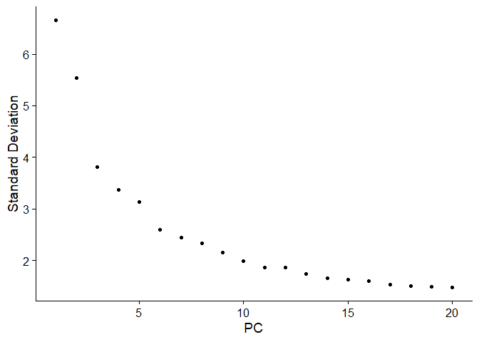
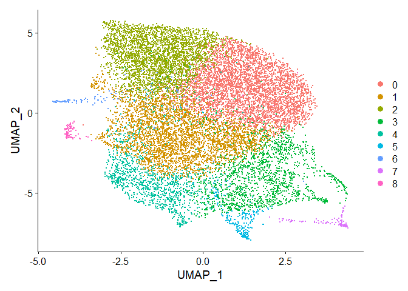
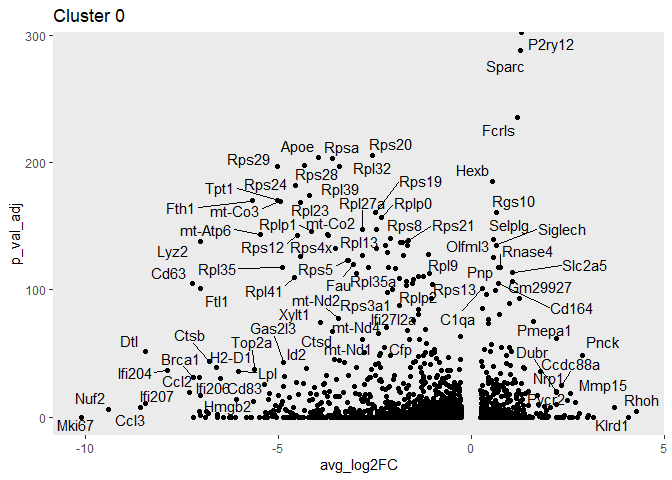
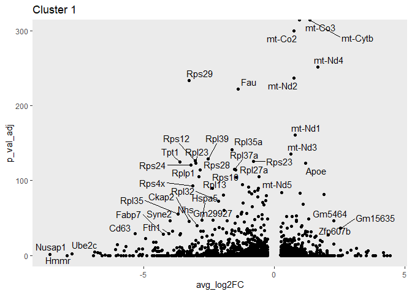
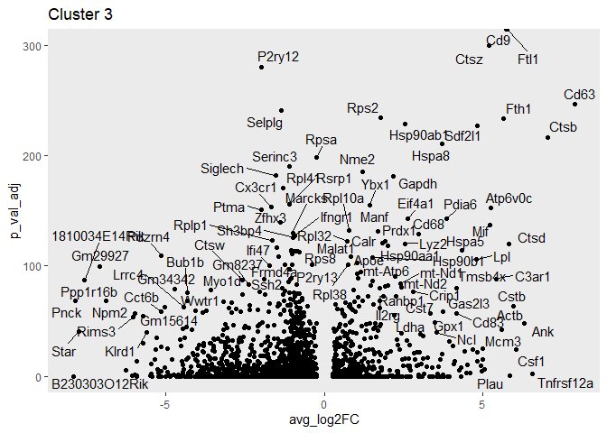
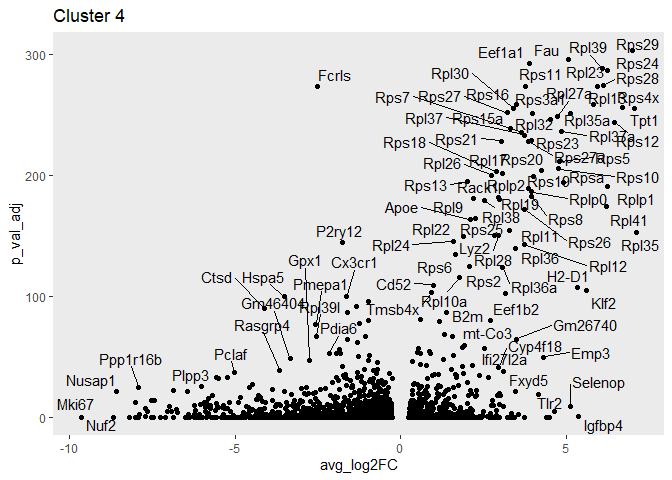
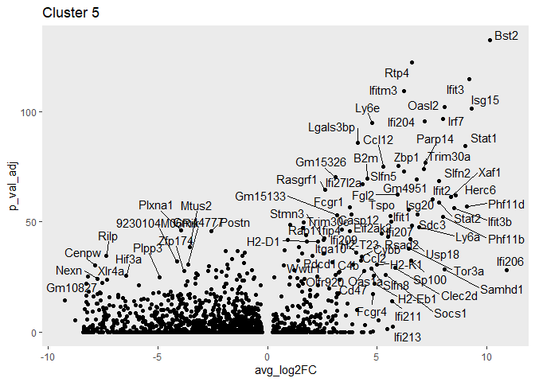
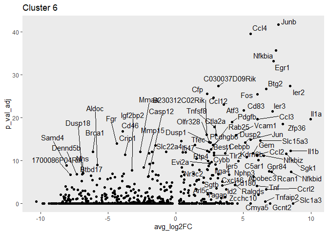
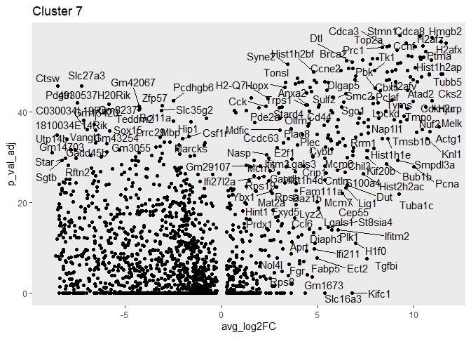
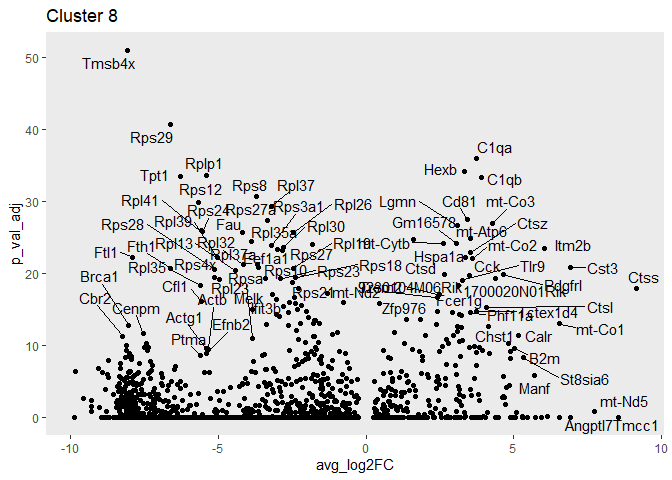

Integrating Data
================
Alina Kline-Schoder
Started on 04/19/2021  
Compiled: January 19, 2022

-   [Microglia Data analysis](#microglia-data-analysis)
-   [Clustering](#clustering)
-   [volcano plot for each cluster](#volcano-plot-for-each-cluster)
    -   [Cluster 0](#cluster-0)
    -   [Cluster 3](#cluster-3)
    -   [Cluster 4](#cluster-4)
    -   [Cluster 5](#cluster-5)
    -   [Cluster 6](#cluster-6)
    -   [Cluster 7](#cluster-7)
    -   [Cluster 8](#cluster-8)

# Microglia Data analysis

    ## Warning: package 'Seurat' was built under R version 4.1.2

    ## Warning: package 'BiocManager' was built under R version 4.1.2

    ## Warning: package 'ggplot2' was built under R version 4.1.2

    ## Warning: package 'readr' was built under R version 4.1.2

    ## Warning: package 'ggsignif' was built under R version 4.1.2

    ## Warning: package 'broom' was built under R version 4.1.2

    ## Warning: package 'ggpmisc' was built under R version 4.1.2

    ## Warning: package 'ggpp' was built under R version 4.1.2

# Clustering

``` r
DefaultAssay(Microglia)<-"integrated"
Microglia <- ScaleData(Microglia)
```

    ## Centering and scaling data matrix

``` r
Microglia <- RunPCA(Microglia)
```

    ## PC_ 1 
    ## Positive:  Rpl41, Rpsa, Rpl32, Rps29, Rps24, Tpt1, Rps28, Rplp1, Rps19, Rps12 
    ##     Fth1, Rps20, Rplp0, Rps27a, Rpl37a, Rpl39, Ftl1, Rps2, Rplp2, Tmsb4x 
    ##     Rpl23, Rpl13, Fau, Rps5, Rpl27a, Rps16, Rps8, Rpl35, Rps3a1, Rps4x 
    ## Negative:  Cx3cr1, P2ry12, Malat1, Selplg, Qk, Gpr34, Vsir, Serinc3, Maf, Tmem119 
    ##     Marcks, P2ry13, Mef2a, Siglech, Arhgap5, Sparc, Rhob, Zfhx3, Tgfbr1, Epb41l2 
    ##     Srgap2, Ifngr1, Rsrp1, Cd164, Nav2, Ddx5, Mef2c, Rnase4, Frmd4a, Ivns1abp 
    ## PC_ 2 
    ## Positive:  Mki67, Top2a, Birc5, Nusap1, Ube2c, Cdca8, Prc1, Hmmr, Stmn1, Cenpf 
    ##     Hmgb2, Spc24, Ccnf, Cdk1, Knl1, Pclaf, Cdca3, Ccna2, Pbk, Lockd 
    ##     Tpx2, Cenpe, Fignl1, Mis18bp1, Tk1, Kif22, Rad51, H2afx, Rad51ap1, Smc2 
    ## Negative:  Rps29, Rpl30, Rpl23, Tyrobp, Rpl27a, Rps21, Fau, Rps27, Rps12, Rplp1 
    ##     Eef1a1, Rpl37, Rps24, Rps28, Rpl13, Rps11, Rps23, Rpl39, Rps3a1, Rpl17 
    ##     Rpl12, Tpt1, Rps10, Ftl1, Apoe, Rpl35a, Rpl9, Rpl37a, Fth1, Rplp0 
    ## PC_ 3 
    ## Positive:  Ctsb, Cd9, Ccl4, Cd63, Ctsz, Ccl3, Cd83, Atp6v0c, Ifit3, Csf1 
    ##     Ctsd, Lpl, Ccl2, Bst2, Atf3, C3ar1, Lgals3, Ifitm3, Lilrb4a, Fam20c 
    ##     Hspa5, Ccl12, Oasl2, Isg15, Ifi204, Rtp4, Irf7, Slc15a3, Cybb, Ftl1 
    ## Negative:  Fau, Rps29, Rps27, Rps4x, Rpl35a, Rps10, Rpl30, Rpl39, Rpl28, Rpl13 
    ##     Rpl23, Tpt1, Rps11, Rpl37, Rps24, Rps7, Rps23, Rpl37a, Eef1a1, Rps12 
    ##     Rps21, Rps3a1, Rps5, Rpl27a, Rps27a, Rps16, Rpl17, Rps15a, Rpl26, Rpl36a 
    ## PC_ 4 
    ## Positive:  Ctsd, Fcrls, Cst3, Cd9, Hexb, C1qb, Trem2, Atp6v0c, Ctsz, C1qa 
    ##     Cd68, Cd63, Tyrobp, Calr, Sdf2l1, Ctsl, Syngr1, Gapdh, Fcer1g, Manf 
    ##     Itm2b, Ctsb, Pdia6, Mif, Sparc, Phgdh, Nme1, Mt1, Ank, Lgmn 
    ## Negative:  Ifi204, Ifit3, Ifitm3, Rtp4, Isg15, Oasl2, Irf7, Ifit2, Ifit3b, Slfn5 
    ##     Parp14, Ifit1, Stat1, Rsad2, Ifi207, Gm4951, Zbp1, Slfn2, Usp18, Ifi27l2a 
    ##     Fgl2, Phf11d, Ifi206, Trim30a, Sp100, Ifi209, Phf11b, Xaf1, Bst2, 9930111J21Rik2 
    ## PC_ 5 
    ## Positive:  Cd83, Ccl3, Ccl4, Mef2a, Malat1, Macf1, C3ar1, Gm26917, Lpl, Rrbp1 
    ##     Nes, Slc15a3, Ftl1, Atf3, Id2, Zeb2, Kcnq1ot1, Fam20c, Cd63, Pnn 
    ##     Gas2l3, Gem, Ssh2, C5ar1, Eif4a1, Ankrd12, Cd84, Pdgfa, Tnfrsf12a, Lilrb4a 
    ## Negative:  Cst3, C1qb, Itm2b, C1qa, Ifit3, Isg15, Rtp4, Ifitm3, Hexb, Oasl2 
    ##     Fcer1g, Ctss, Bst2, Rgs10, Irf7, Ifit2, Ly6e, Cd81, Sparc, Ly6a 
    ##     B2m, Ifi204, Ifit3b, Ifit1, Rsad2, Usp18, Tyrobp, Xaf1, Slfn5, Gm4951

``` r
ElbowPlot(Microglia)
```

<!-- -->

``` r
Microglia <- FindNeighbors(Microglia, dims = 1:15)
```

    ## Computing nearest neighbor graph

    ## Computing SNN

``` r
Microglia <- FindClusters(Microglia, resolution = 0.5)
```

    ## Modularity Optimizer version 1.3.0 by Ludo Waltman and Nees Jan van Eck
    ## 
    ## Number of nodes: 14197
    ## Number of edges: 430660
    ## 
    ## Running Louvain algorithm...
    ## Maximum modularity in 10 random starts: 0.7943
    ## Number of communities: 9
    ## Elapsed time: 2 seconds

``` r
Microglia <- RunUMAP(Microglia, dims = 1:15,metric = "euclidean")
```

    ## Warning: The default method for RunUMAP has changed from calling Python UMAP via reticulate to the R-native UWOT using the cosine metric
    ## To use Python UMAP via reticulate, set umap.method to 'umap-learn' and metric to 'correlation'
    ## This message will be shown once per session

    ## 17:31:59 UMAP embedding parameters a = 0.9922 b = 1.112

    ## 17:31:59 Read 14197 rows and found 15 numeric columns

    ## 17:31:59 Using Annoy for neighbor search, n_neighbors = 30

    ## 17:31:59 Building Annoy index with metric = euclidean, n_trees = 50

    ## 0%   10   20   30   40   50   60   70   80   90   100%

    ## [----|----|----|----|----|----|----|----|----|----|

    ## **************************************************|
    ## 17:32:00 Writing NN index file to temp file C:\Users\UEIL\AppData\Local\Temp\RtmpkxzLgi\file2ff84c647a2c
    ## 17:32:00 Searching Annoy index using 1 thread, search_k = 3000
    ## 17:32:05 Annoy recall = 100%
    ## 17:32:05 Commencing smooth kNN distance calibration using 1 thread
    ## 17:32:07 Initializing from normalized Laplacian + noise
    ## 17:32:07 Commencing optimization for 200 epochs, with 647448 positive edges
    ## 17:32:25 Optimization finished

``` r
DimPlot(Microglia)
```

<!-- -->

# volcano plot for each cluster

## Cluster 0

``` r
mark0 <- FindMarkers(Microglia,ident.1 = "0")
toptable <- as.data.frame(mark0)
toptable$lab <- rownames(mark0)
toptable$p_val_adj <- -log10(toptable[['p_val_adj']])
toptable[abs(toptable$avg_log2FC)<logFC&toptable$p_val_adj<p_val,]$lab<-""

ggplot(toptable, aes(x = avg_log2FC, y = p_val_adj)) + 
    geom_point() +
    geom_text_repel(aes(label=lab),max.overlaps = 20)+
    theme(panel.grid = element_blank())+labs(title="Cluster 0")
```

    ## Warning: ggrepel: 367 unlabeled data points (too many overlaps). Consider
    ## increasing max.overlaps

<!-- -->
\#\# Cluster 1

``` r
mark1 <- FindMarkers(Microglia,ident.1 = "1")
toptable <- as.data.frame(mark1)
toptable$lab <- rownames(mark1)
toptable$p_val_adj <- -log10(toptable[['p_val_adj']])
toptable[abs(toptable$avg_log2FC)<logFC&toptable$p_val_adj<p_val,]$lab<-""

ggplot(toptable, aes(x = avg_log2FC, y = p_val_adj)) + 
    geom_point() +
    geom_text_repel(aes(label=lab),max.overlaps = 20)+
    theme(panel.grid = element_blank())+labs(title="Cluster 1")
```

    ## Warning: ggrepel: 302 unlabeled data points (too many overlaps). Consider
    ## increasing max.overlaps

<!-- -->
\#\# Cluster 2

``` r
logFC<-2
p_val<-200
mark2 <- FindMarkers(Microglia,ident.1 = "2")
toptable <- as.data.frame(mark2)
toptable$lab <- rownames(mark2)
toptable$p_val_adj <- -log10(toptable[['p_val_adj']])
toptable[abs(toptable$avg_log2FC)<logFC&toptable$p_val_adj<p_val,]$lab<-""

ggplot(toptable, aes(x = avg_log2FC, y = p_val_adj)) + 
    geom_point() +
    geom_text_repel(aes(label=lab),max.overlaps = 50)+
    theme(panel.grid = element_blank())+labs(title="Cluster 2")
```

    ## Warning: ggrepel: 270 unlabeled data points (too many overlaps). Consider
    ## increasing max.overlaps

<!-- -->

## Cluster 3

``` r
logFC<-2
p_val<-100
mark3 <- FindMarkers(Microglia,ident.1 = "3")
toptable <- as.data.frame(mark3)
toptable$lab <- rownames(mark3)
toptable$p_val_adj <- -log10(toptable[['p_val_adj']])
toptable[abs(toptable$avg_log2FC)<logFC&toptable$p_val_adj<p_val,]$lab<-""

ggplot(toptable, aes(x = avg_log2FC, y = p_val_adj)) + 
    geom_point() +
    geom_text_repel(aes(label=lab),max.overlaps = 20)+
    theme(panel.grid = element_blank())+labs(title="Cluster 3")
```

    ## Warning: ggrepel: 508 unlabeled data points (too many overlaps). Consider
    ## increasing max.overlaps

<!-- -->

## Cluster 4

``` r
mark4 <- FindMarkers(Microglia,ident.1 = "4")
toptable <- as.data.frame(mark4)
toptable$lab <- rownames(mark4)
toptable$p_val_adj <- -log10(toptable[['p_val_adj']])
toptable[abs(toptable$avg_log2FC)<logFC&toptable$p_val_adj<p_val,]$lab<-""

ggplot(toptable, aes(x = avg_log2FC, y = p_val_adj)) + 
    geom_point() +
    geom_text_repel(aes(label=lab),max.overlaps = 20)+
    theme(panel.grid = element_blank())+labs(title="Cluster 4")
```

    ## Warning: ggrepel: 525 unlabeled data points (too many overlaps). Consider
    ## increasing max.overlaps

<!-- -->

## Cluster 5

``` r
mark5 <- FindMarkers(Microglia,ident.1 = "5")
toptable <- as.data.frame(mark5)
toptable$lab <- rownames(mark5)
toptable$p_val_adj <- -log10(toptable[['p_val_adj']])
toptable[abs(toptable$avg_log2FC)<logFC&toptable$p_val_adj<p_val,]$lab<-""

ggplot(toptable, aes(x = avg_log2FC, y = p_val_adj)) + 
    geom_point() +
    geom_text_repel(aes(label=lab),max.overlaps = 20)+
    theme(panel.grid = element_blank())+labs(title="Cluster 5")
```

    ## Warning: ggrepel: 854 unlabeled data points (too many overlaps). Consider
    ## increasing max.overlaps

<!-- -->

## Cluster 6

``` r
mark6 <- FindMarkers(Microglia,ident.1 = "6")
toptable <- as.data.frame(mark6)
toptable$lab <- rownames(mark6)
toptable$p_val_adj <- -log10(toptable[['p_val_adj']])
toptable[abs(toptable$avg_log2FC)<logFC&toptable$p_val_adj<p_val,]$lab<-""

ggplot(toptable, aes(x = avg_log2FC, y = p_val_adj)) + 
    geom_point() +
    geom_text_repel(aes(label=lab),max.overlaps = 20)+
    theme(panel.grid = element_blank())+labs(title="Cluster 6")
```

    ## Warning: ggrepel: 1031 unlabeled data points (too many overlaps). Consider
    ## increasing max.overlaps

<!-- -->

## Cluster 7

``` r
mark7 <- FindMarkers(Microglia,ident.1 = "7")
toptable <- as.data.frame(mark7)
toptable$lab <- rownames(mark7)
toptable$p_val_adj <- -log10(toptable[['p_val_adj']])
toptable[abs(toptable$avg_log2FC)<logFC&toptable$p_val_adj<p_val,]$lab<-""

ggplot(toptable, aes(x = avg_log2FC, y = p_val_adj)) + 
    geom_point() +
    geom_text_repel(aes(label=lab),max.overlaps = 20)+
    theme(panel.grid = element_blank())+labs(title="Cluster 7")
```

    ## Warning: ggrepel: 969 unlabeled data points (too many overlaps). Consider
    ## increasing max.overlaps

<!-- -->

## Cluster 8

``` r
mark8 <- FindMarkers(Microglia,ident.1 = "8")
toptable <- as.data.frame(mark8)
toptable$lab <- rownames(mark8)
toptable$p_val_adj <- -log10(toptable[['p_val_adj']])
toptable[abs(toptable$avg_log2FC)<logFC&toptable$p_val_adj<p_val,]$lab<-""

ggplot(toptable, aes(x = avg_log2FC, y = p_val_adj)) + 
    geom_point() +
    geom_text_repel(aes(label=lab),max.overlaps = 20)+
    theme(panel.grid = element_blank())+labs(title="Cluster 8")
```

    ## Warning: ggrepel: 1090 unlabeled data points (too many overlaps). Consider
    ## increasing max.overlaps

<!-- -->
